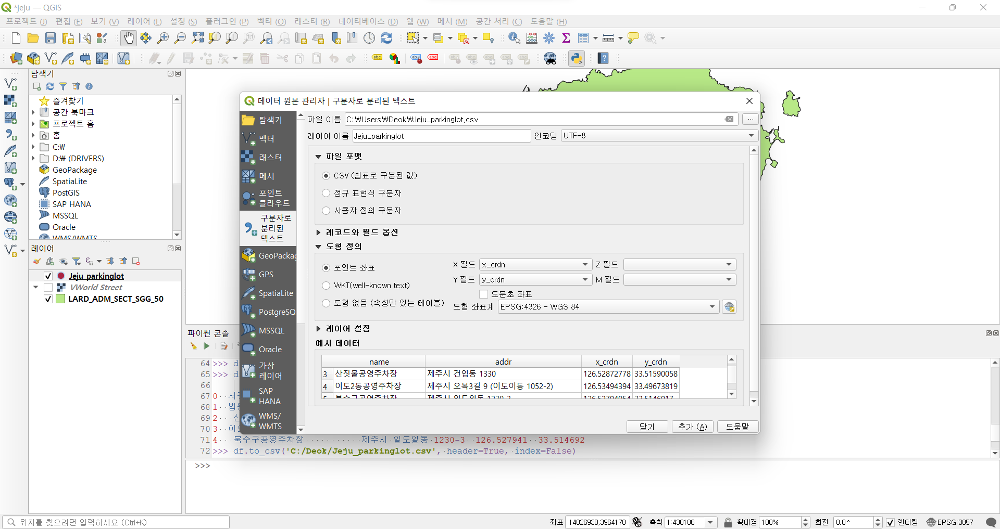

# QGIS 사용 Tip 및 작업 내용
[QGIS 설치]

본 프로젝트에서는 2022.12. 기준 안정화 버전인 **QGIS 3.22.13 Biatowieza**를 사용한다.

다운로드 주소 : <https://qgis.org/ko/site/forusers/download.html>

QGIS에서 제공하는 Document를 참고하여 작업을 진행하였다.

  공식문서 : <https://docs.qgis.org/3.22/en/docs/training_manual/index.html>
  
***
[데이터 수집]

국가교통부 국가공간정보포털 오픈마켓 - 행정구역시군구 경계도면 SHP파일 

    링크주소 : http://data.nsdi.go.kr/dataset/15144
      
공공데이터포털 -  제주특별자치도_주차장기본정보 오픈API 데이터 

    활용신청 링크주소 : http://www.jejuits.go.kr/open_api/open_apiView.do

***
### [Open API DATA를 이용한 QGIS작업 내용]

QGIS 실행 후, 기본 화면에서 수집한 제주시 경계도면 SHP 파일을 불러온다. 


좌표계 설정 후,

공공데이터포털에서 수집한 제주도 주차장기본정보 오픈API데이터를 활용하기 위해 파이썬에서 API를 불러오는 코드를 작성한다.

QGIS 상태 툴바에서 '플러그인'->'파이썬 콘솔 창' 혹은 단축키 Ctrl + Alt + P를 입력하면 QGIS상에서의 파이썬 콘솔 창을 열 수 있다.


먼저 필요한 모듈을 추가해야하는데, GET방식의 URL을 호출하기 위한 requests와 데이터 조작에 필요한 pandas를 추가한다.

```python
#모듈을 추가한다.
import requests
import pandas as pd
```

URL에 주소를 담아 GET방식으로 데이터 호출 후에 결과값을 JSON으로 받는다.

```python
#제주도내 주차장 기본정보 API를 받아온다.
url = "http://api.jejuits.go.kr/api/infoParkingInfoList?code=860538"
json_obj = requests.get(url).json()
json_obj
```


받아온 결과값은 다음과 같다. 'info_cnt'값이 10이므로 10개의 주차장 데이터가 있다는 것을 확인할 수 있고, 하나의 id값을 예시로 들어보면 다음과 같다

```python
{'result': 'success', 'info_cnt': 10, 'info': [{'id': '11111111', 'name': '서귀포매일올레시장', 'addr': '서귀포시 중앙로 62번길 18', 'x_crdn': 126.56326295, 'y_crdn': 33.25031562, 'park_day': '월화수목금토일', 'wkdy_strt': '090000', 'wkdy_end': '180000', 'lhdy_strt': '090000', 'lhdy_end': '180000', 'basic_time': 30, 'basic_fare': 1000, 'add_time': 15, 'add_fare': 500, 'whol_npls': 216}
```

데이터를 잘 받아온 것을 확인할 수 있고 주차장 이름과 주소, 좌표와 주차가능요일, 주차시간등의 데이터를 가지고 있는것을 확인할 수 있다.

이 데이터를 이용하여 pandas dataframe으로 필요한 정보만을 가공할 수 있다. 모든 데이터가 'id'값을 가지고 있으므로 리스트를 생성하여 list.append를 사용하여 필요한 정보인 이름과 주소, x좌표와 y좌표를 리스트에 추가하고 이를 데이터프레임으로 만들었다. 코드는 다음과 같다.

```python
#list를 만들어 데이터프레임화 하고 head를 찍어보았다.
list = []
for infos in json_obj['info']:
    if infos.get('id'):
        list.append([infos['name'],infos['addr'],infos['x_crdn'],infos['y_crdn']])
df = pd.DataFrame(list, columns = ['name', 'addr', 'x_crdn', 'y_crdn'])
df.head()
```


가공이 잘 된 것을 확인할 수 있다.

가공된 데이터를 CSV파일로 저장한다.

```python
#CSV 파일로 저장한다.
df.to_csv('C:/Deok/Jeju_parkinglot.csv', header=True, index=False)
```

저장된 CSV파일을 QGIS 상태 툴바에서 '레이어'->'레이어 추가'->'구분자로 분리된 텍스트 레이어 추가' 단축키 Ctrl + Shift + T를 클릭해 QGIS상에 추가한다.



레이어가 잘 추가된 것을 확인할 수 있다.


VWorldStreet 레이어를 사용한 화면은 다음과 같다.


***
### [csv파일 데이터를 이용한 작업 내용]

수집한 csv데이터를 활용해 QGIS 상태 툴바에서 '레이어'->'레이어 추가'->'구분자로 분리된 텍스트 레이어 추가' 단축키 Ctrl + Shift + T를 클릭해 QGIS상에 추가한다.


제주시와 서귀포시에 있는 주차장이 표시된 것을 확인할 수 있다.


VWorldStreet 레이어를 사용한 화면은 다음과 같다.
